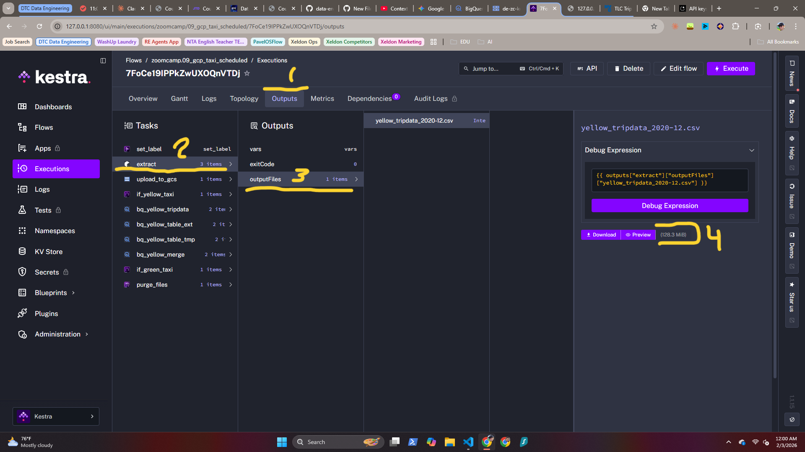
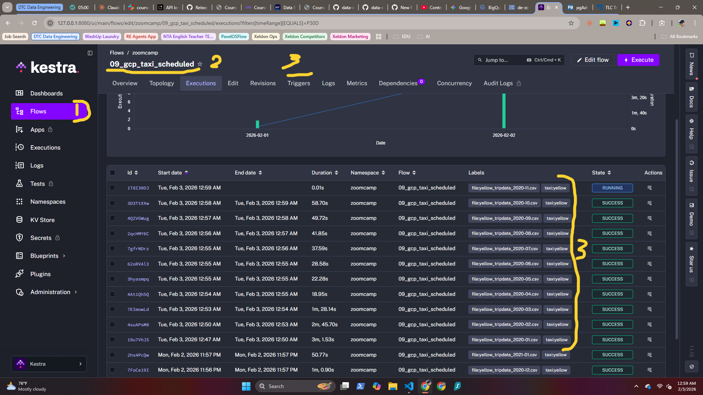

## PAVEL GARANIN

# DATA ENGINEERING ZOOMCAMP by DataTalksClub
### | Module 02: Workflow Orchesration w/ Kestra + GCP + Gemini |

---
### HOMEWORK

#### Q1:
***A1: 128.3MB***




#### Q2:
***A2: green_tripdata_2020-04.csv***

```YAML
variables:
  file: "{{inputs.taxi}}_tripdata_{{inputs.year}}-{{inputs.month}}.csv"
```
becomes "green_tripdata_2020-04.csv"

#### Q3:
***A3: 24,648,499***





#### Q4:
***A4: 1,734,051***


screenshots

#### Q5:
***A5: 1,428,092***


screenshots

#### Q6:
***A6: Add a timezone property set to America/New_York in the Schedule trigger configuration***


```YAML
triggers:
  - id: green_schedule
    type: io.kestra.plugin.core.trigger.Schedule
    timezone: America/New_York
    cron: "0 9 1 * *"
    inputs:
      taxi: green
```
