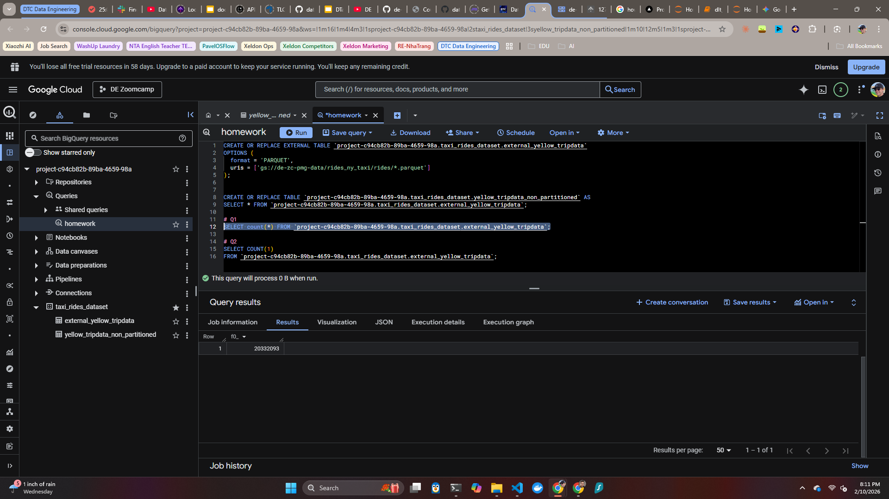
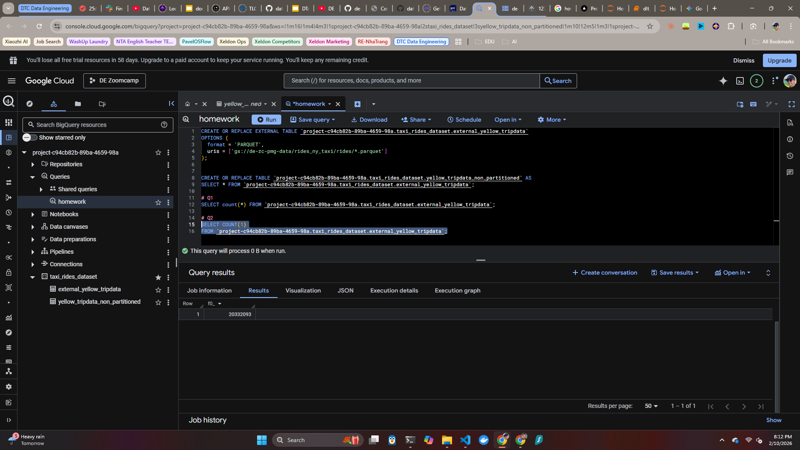
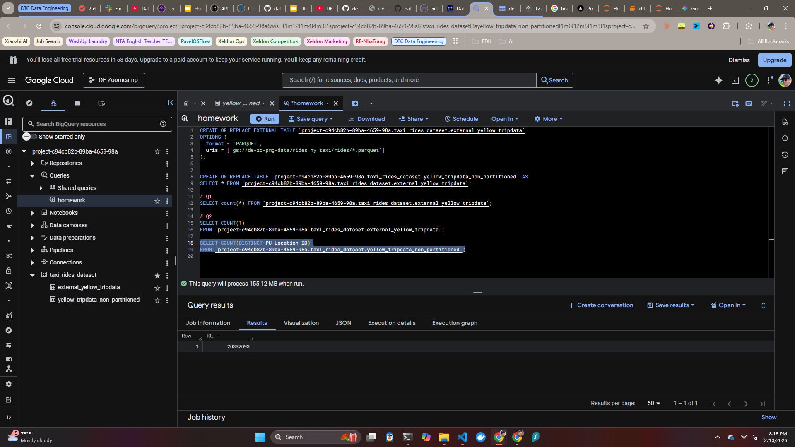
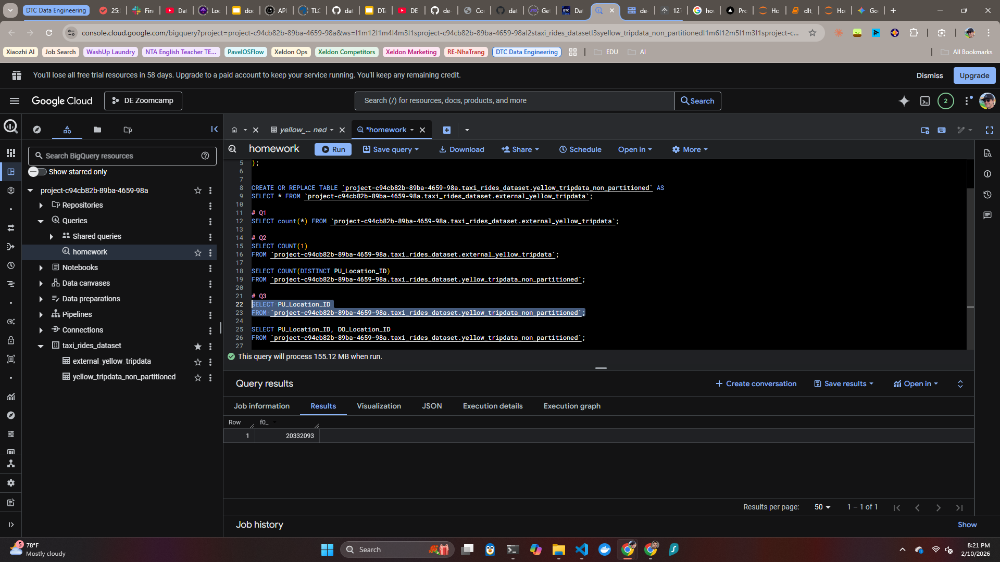
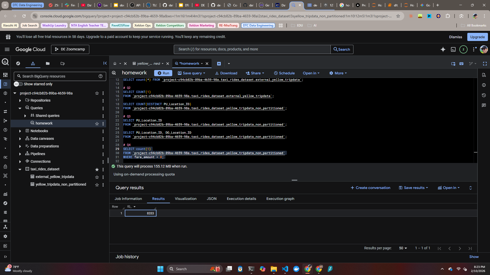
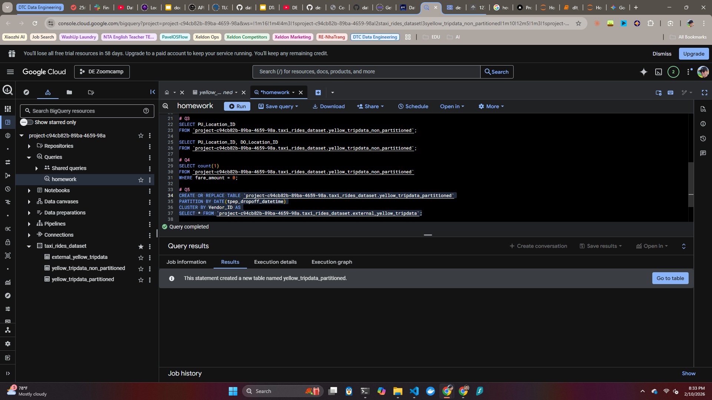
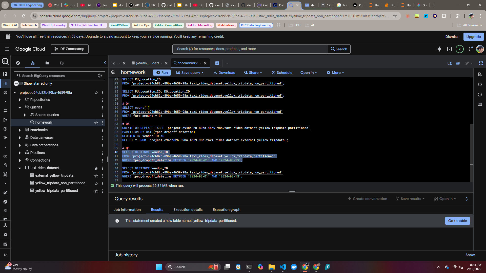
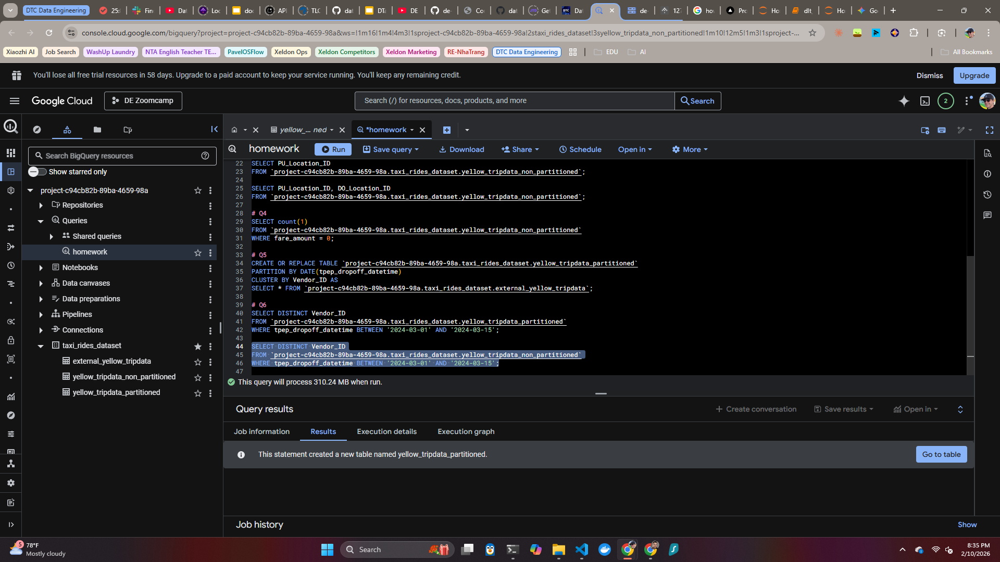
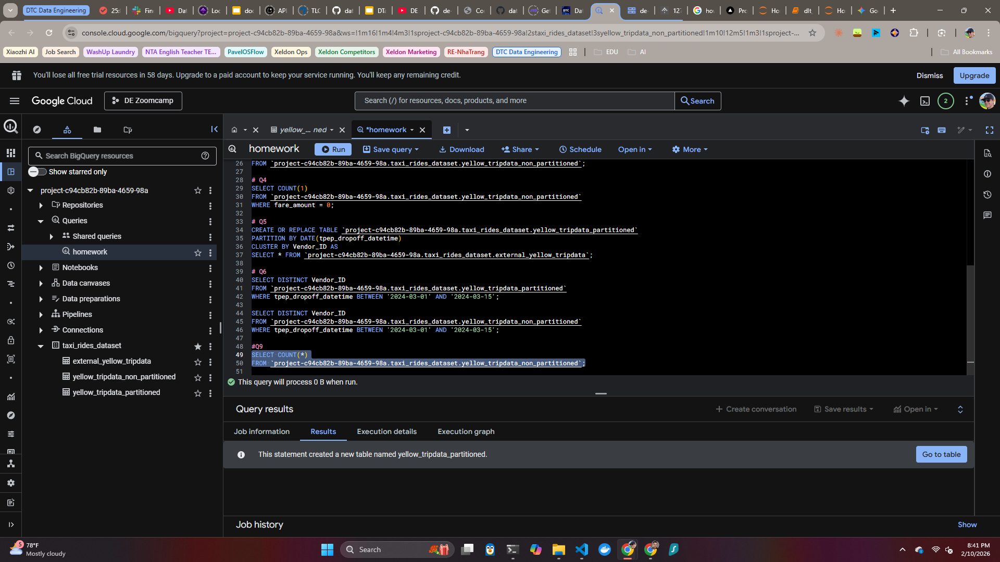

## PAVEL GARANIN

# DATA ENGINEERING ZOOMCAMP by DataTalksClub
### | Module 03: Data Warehouse + BigQuery |

---
### HOMEWORK

#### Q1:
***A1: 20,332,093***

#### Q2:
***A2: 0 MB for the External Table and 155.12 MB for the Materialized Table***

#### Q3:
***A3: BigQuery is a columnar database, and it only scans the specific columns requested in the query. Querying two columns (PULocationID, DOLocationID) requires reading more data than querying one column (PULocationID), leading to a higher estimated number of bytes processed.***

#### Q4:
***A4: 8,333***

#### Q5:
***A5: Partition by tpep_dropoff_datetime and Cluster on VendorID***

#### Q6:
***A6: 310.24 MB for non-partitioned table and 26.84 MB for the partitioned table***

### Q7:
***A7: GCP Bucket***

### Q8:
***A8: False***

### Q9:
***A9: 0B, because BigQuery saves ths in table details on creation.***

