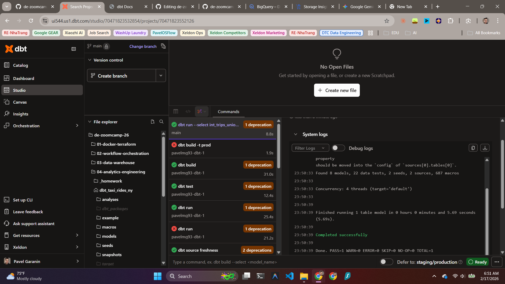
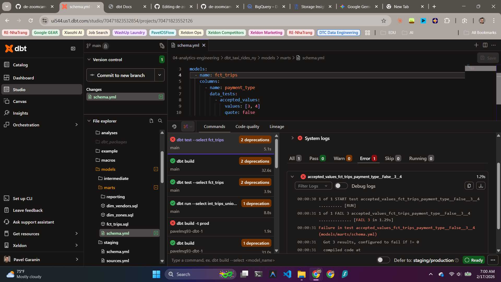
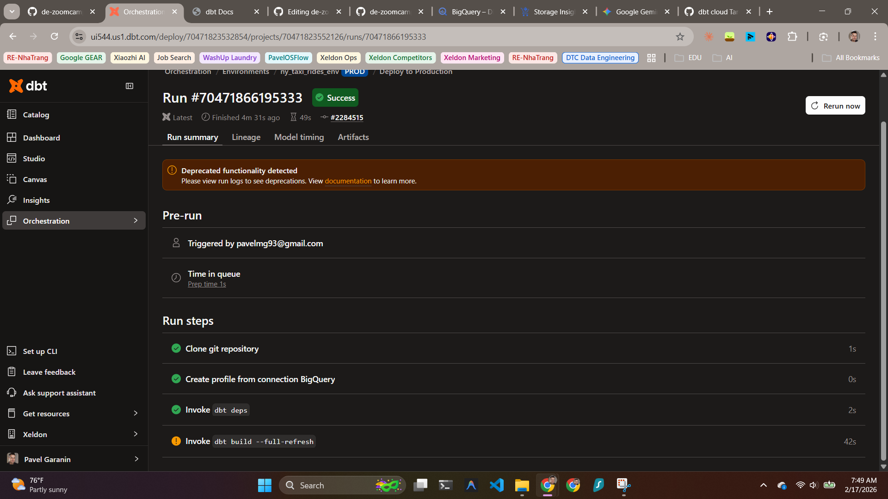
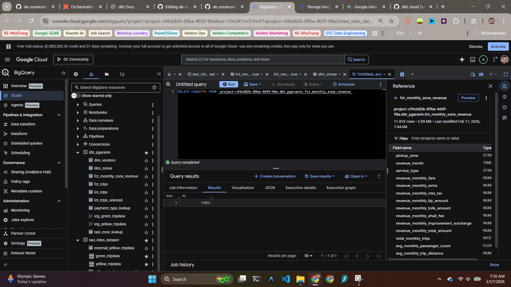
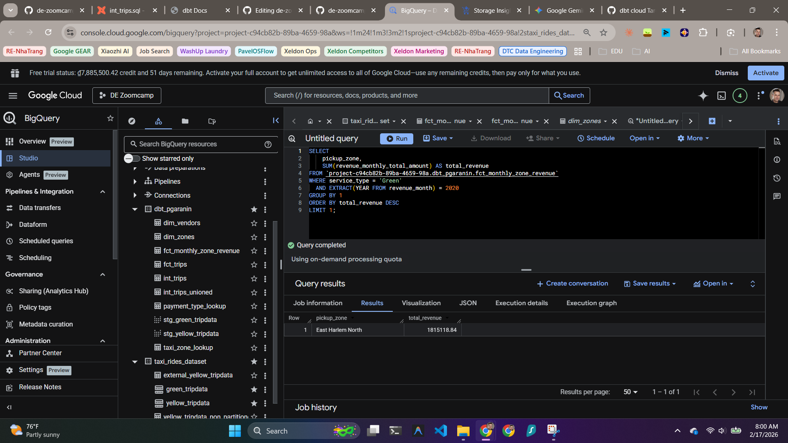
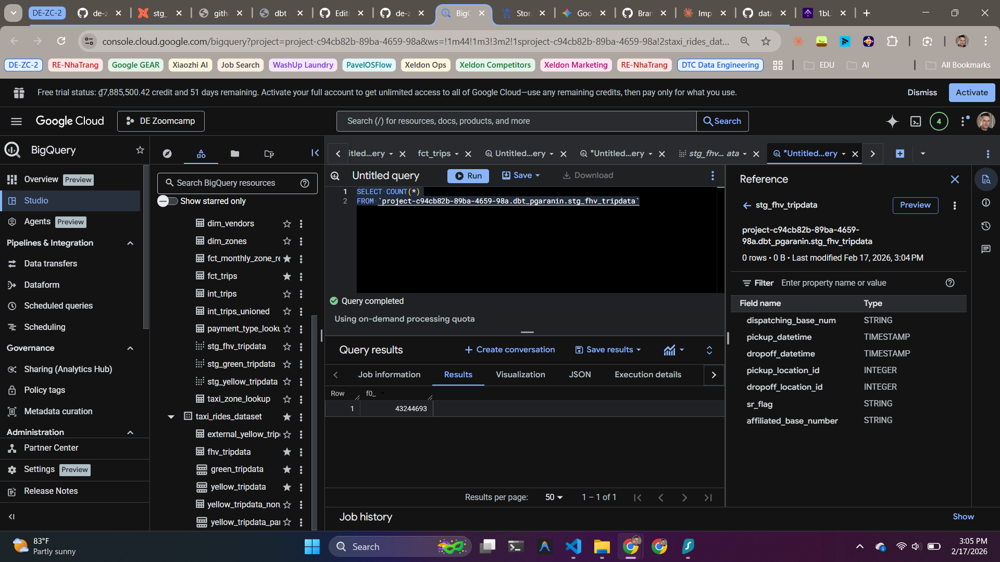

## PAVEL GARANIN

# DATA ENGINEERING ZOOMCAMP by DataTalksClub
### | Module 04: Analytics Engineering + dbt |

---
### HOMEWORK

#### Q1:
***A1: int_trips_unioned only***

#### Q2:
***A2: dbt will fail the test, returning a non-zero exit code***

#### Q3:
***A3: 12,184***
Deduplication removes some records.

#### Q4:
***A4: East Harlem North***

#### Q5:
***A5: 384,624***

#### Q6:
***A6: 43,244,693***

