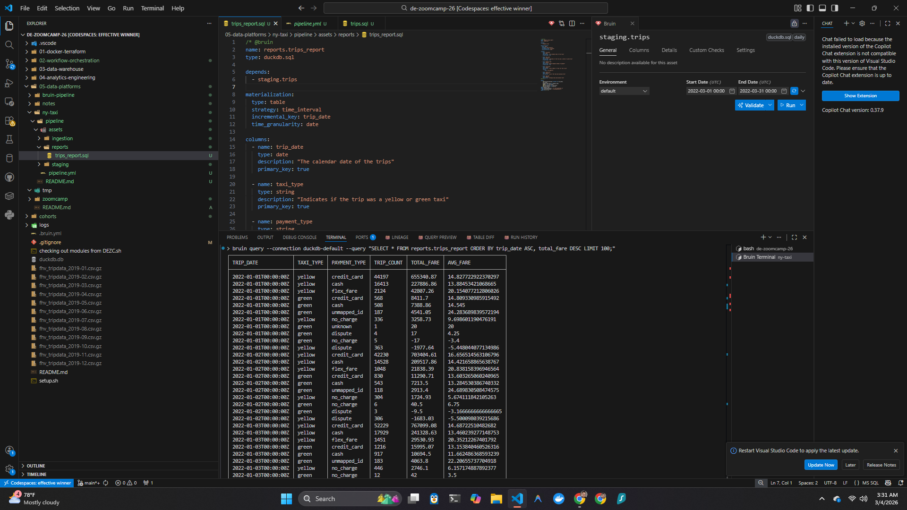

## PAVEL GARANIN

# DATA ENGINEERING ZOOMCAMP by DataTalksClub
### | Module 05: Data Platforms + bruin |

---
### HOMEWORK

#### Q1:
***A1: .bruin.yml and pipeline/ with pipeline.yml and assets/***

#### Q2:
***A2: time_interval - incremental based on a time column***

#### Q3:
***A3: bruin run --var 'taxi_types=["yellow"]'***
Deduplication removes some records.

#### Q4:
***A4: bruin run ingestion/trips.py --downstream***

#### Q5:
***A5: name: not_null***

#### Q6:
***A6: bruin lineage***

#### Q7:
***A7: --full-refresh***

