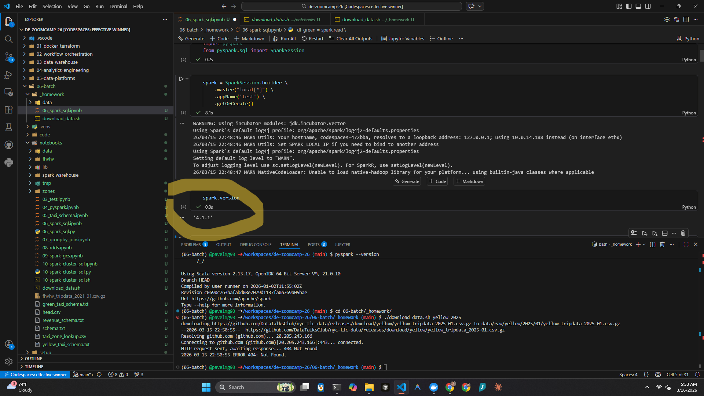
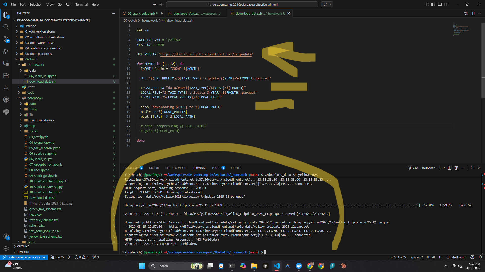
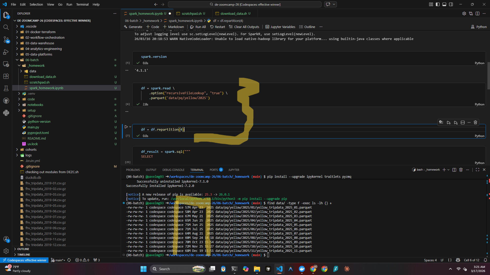
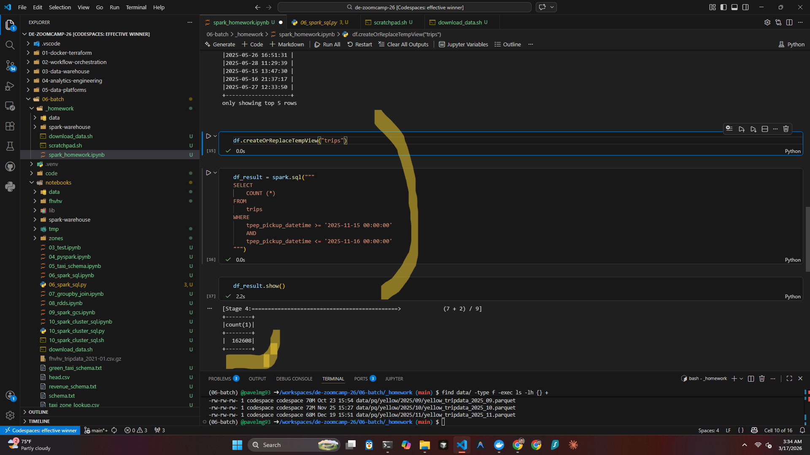
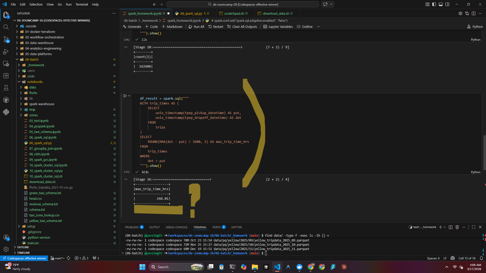
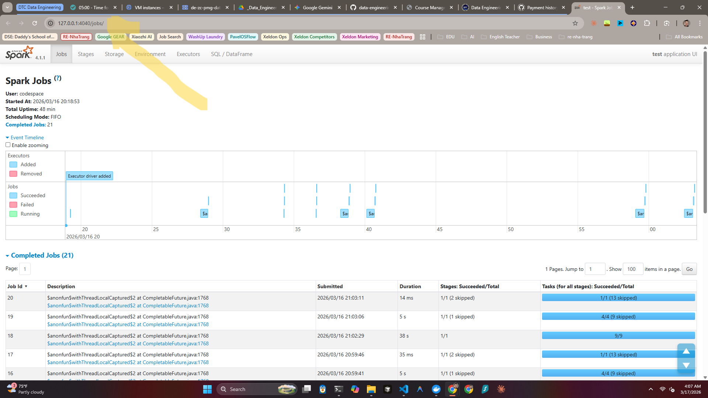
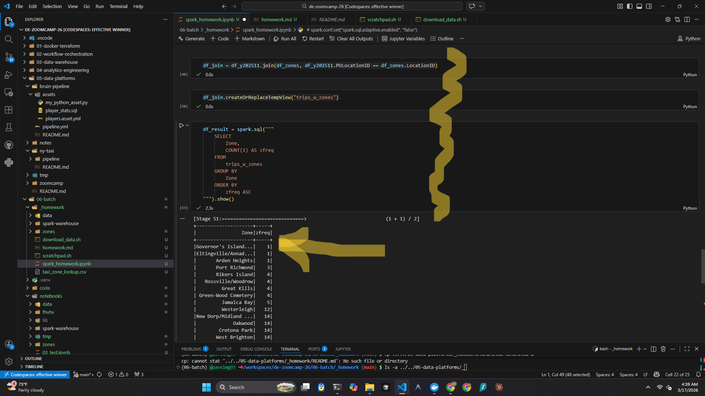

## PAVEL GARANIN

# DATA ENGINEERING ZOOMCAMP by DataTalksClub
### | Module 06: Batch + spark |

---
### HOMEWORK

#### Q1:
***A1: 4.1.1***

#### Q2:
***A2: 75MB***

Closer to 65MB for me.

#### Q3:
***A3: 162,604***

162,608 for me.

#### Q4:
***A4: 134.5***

248 hrous for me.

#### Q5:
***A5: 4040***

#### Q6:
***A6: Governor's Island/Ellis Island/Liberty Island***

