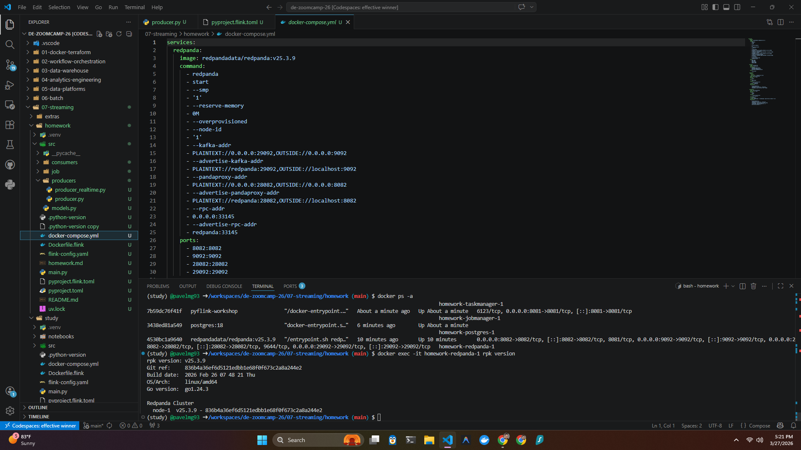
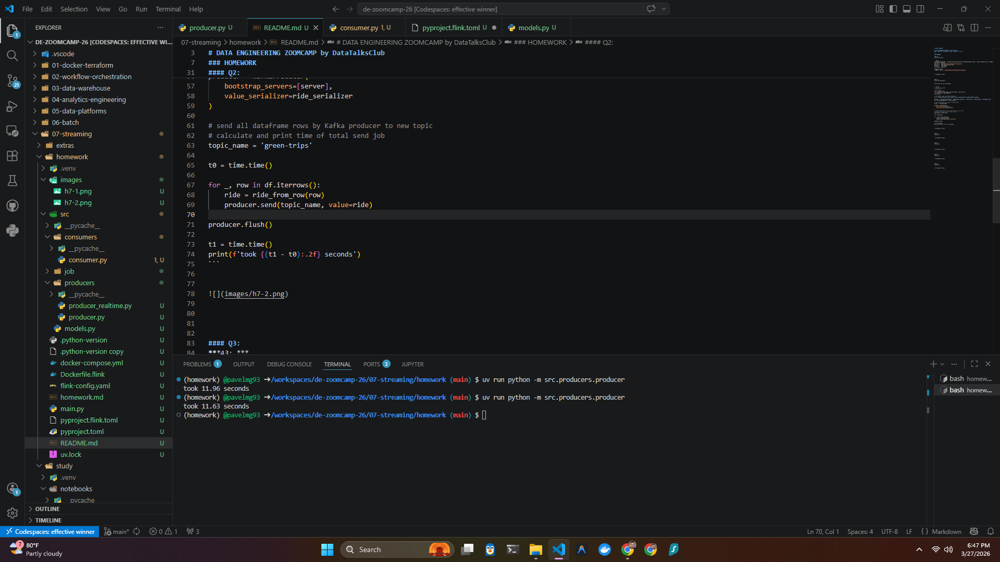
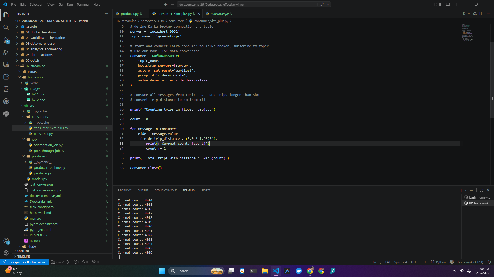
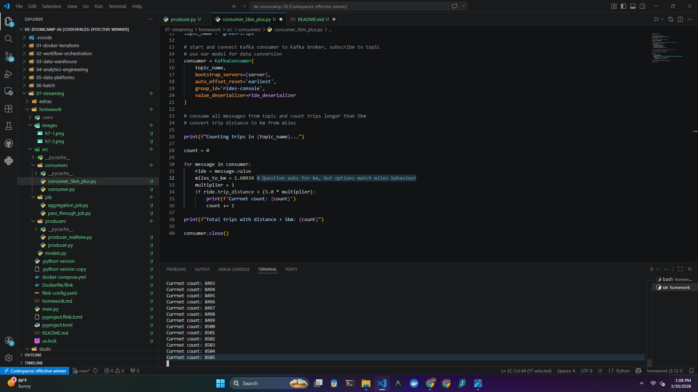
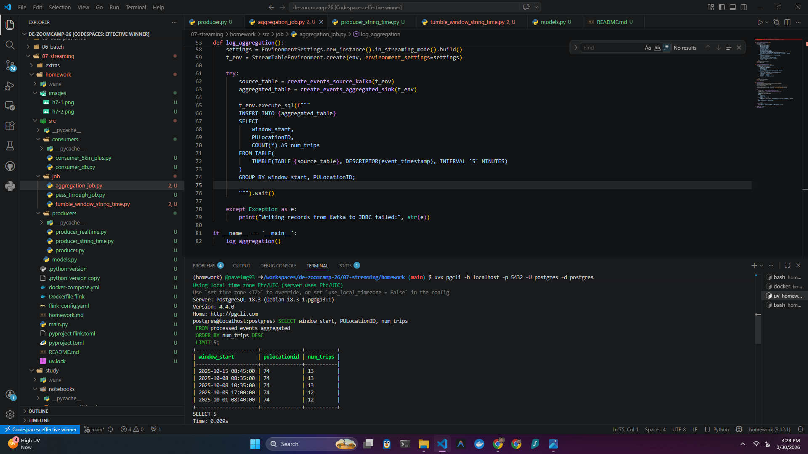
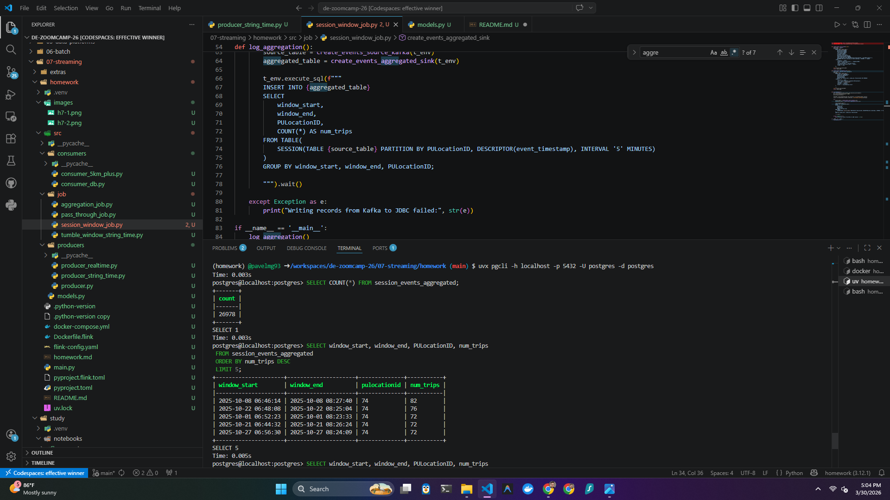
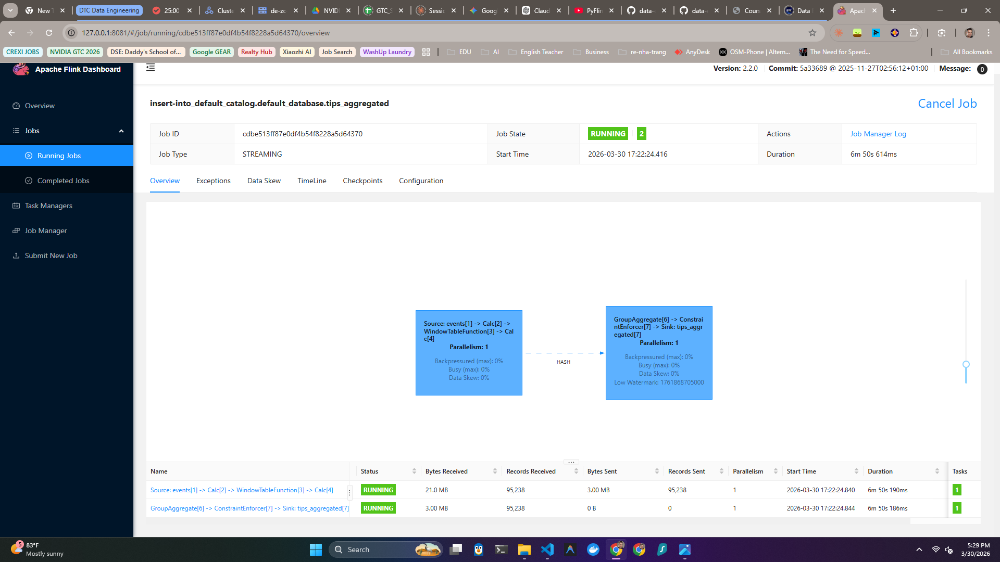

## PAVEL GARANIN
## 2026 Cohort
# DATA ENGINEERING ZOOMCAMP by DataTalksClub
### | Module 07: Streaming + Kafka + RedPanda + Flink |

---
### HOMEWORK

#### Q1:
***A1: v25.3.9***


```bash
(homework) @pavelmg93 ➜ /workspaces/de-zoomcamp-26/07-streaming/homework (main) $ docker compose exec -it redpanda rpk version
rpk version: v25.3.9
Git ref:     836b4a36ef6d5121edbb1e68f0f673c2a8a244e2
Build date:  2026 Feb 26 07 48 21 Thu
OS/Arch:     linux/amd64
Go version:  go1.24.3

Redpanda Cluster
  node-1  v25.3.9 - 836b4a36ef6d5121edbb1e68f0f673c2a8a244e2
```





#### Q2:
***A2: 10 seconds***


11-12 seconds for me on Codespaces


```python
#!/usr/bin/env python
# coding: utf-8

import pandas as pd
from src.models import Ride, ride_serializer, ride_from_row
from kafka import KafkaProducer
import time

# Load parquet data into Pandas dataframe
url = 'https://d37ci6vzurychx.cloudfront.net/trip-data/green_tripdata_2025-10.parquet'

columns = ['lpep_pickup_datetime', 'lpep_dropoff_datetime', 'PULocationID', 'DOLocationID', 'passenger_count', 'trip_distance', 'tip_amount', 'total_amount']
df = pd.read_parquet(url, columns=columns)

# start Kafka producer, connect to Kafka broker
server = 'localhost:9092'

producer = KafkaProducer(
    bootstrap_servers=[server],
    value_serializer=ride_serializer
)

# send all dataframe rows by Kafka producer to new topic
# calculate and print time of total send job
topic_name = 'green-trips'

t0 = time.time()

for _, row in df.iterrows():
    ride = ride_from_row(row)
    producer.send(topic_name, value=ride)

producer.flush()

t1 = time.time()
print(f'took {(t1 - t0):.2f} seconds')
```





#### Q3:
***A3: 8505***

This is for trip_distance > 5 (miles).
Answer is 4206 for trips longer than 5 km


```python
from kafka import KafkaConsumer
from src.models import Ride, ride_deserializer
from datetime import datetime
import psycopg2

# define Kafka broker connection and topic
server = 'localhost:9092'
topic_name = 'green-trips'

# start and connect Kafka consumer to Kafka broker, subscribe to topic
# use our model for data conversion
consumer = KafkaConsumer(
    topic_name,
    bootstrap_servers=[server],
    auto_offset_reset='earliest',
    group_id='rides-console',
    value_deserializer=ride_deserializer
)

# consume all messages from topic and count trips longer than 5km
# convert trip distance to km from miles

print(f"Counting trips in {topic_name}...")

count = 0

for message in consumer:
    ride = message.value
    miles_to_km = 1.60934 # Question asks for km, but options match miles bahaviour
    multiplier = 1
    if ride.trip_distance > (5 * multiplier):
        print(f'Currnet count: {count}')
        count += 1

print(f"Total trips with distance > 5: {count}")

consumer.close()
```





#### Q4:
***A4: 74***


**src/models.py**
```python
import json
import dataclasses

from dataclasses import dataclass
import pandas as pd


@dataclass
class Ride:
    lpep_pickup_datetime: int # epoch milliseconds
    lpep_dropoff_datetime: int # epoch milliseconds
    PULocationID: int
    DOLocationID: int
    passenger_count: int
    trip_distance: float
    tip_amount: float
    total_amount: float

@dataclass
class Ride1:
    lpep_pickup_datetime: str # string time
    lpep_dropoff_datetime: str # string time
    PULocationID: int
    DOLocationID: int
    passenger_count: int
    trip_distance: float
    tip_amount: float
    total_amount: float

def ride_from_row(row):
    return Ride(
        lpep_pickup_datetime=int(row['lpep_pickup_datetime'].timestamp() * 1000),
        lpep_dropoff_datetime=int(row['lpep_dropoff_datetime'].timestamp() * 1000),        
        PULocationID=int(row['PULocationID']),
        DOLocationID=int(row['DOLocationID']),
        passenger_count=int(row['passenger_count']) if pd.notna(row['passenger_count']) else 0,
        trip_distance=float(row['trip_distance']) if pd.notna(row['trip_distance']) else -1,
        tip_amount=float(row['tip_amount']) if pd.notna(row['tip_amount']) else 0,
        total_amount=float(row['total_amount']) if pd.notna(row['total_amount']) else 0,
    )

def ride_from_row1(row):
    return Ride1(
        # Convert the pandas timestamp to the exact string format Flink expects
        lpep_pickup_datetime=row['lpep_pickup_datetime'].strftime('%Y-%m-%d %H:%M:%S'),
        lpep_dropoff_datetime=row['lpep_dropoff_datetime'].strftime('%Y-%m-%d %H:%M:%S'),      
        PULocationID=int(row['PULocationID']),
        DOLocationID=int(row['DOLocationID']),
        passenger_count=int(row['passenger_count']) if pd.notna(row['passenger_count']) else 0,
        trip_distance=float(row['trip_distance']) if pd.notna(row['trip_distance']) else -1,
        tip_amount=float(row['tip_amount']) if pd.notna(row['tip_amount']) else 0,
        total_amount=float(row['total_amount']) if pd.notna(row['total_amount']) else 0,
    )

def ride_serializer(ride):
    ride_dict = dataclasses.asdict(ride)
    ride_json = json.dumps(ride_dict).encode('utf-8')
    return ride_json


def ride_deserializer(data):
    json_str = data.decode('utf-8')
    ride_dict = json.loads(json_str)
    return Ride(**ride_dict)

def ride_deserializer1(data):
    json_str = data.decode('utf-8')
    ride_dict = json.loads(json_str)
    return Ride1(**ride_dict)
```


**src/producers/producer_string_time.py**
```python
#!/usr/bin/env python
# coding: utf-8

import pandas as pd
from src.models import Ride1, ride_serializer, ride_from_row1
from kafka import KafkaProducer
import time

# Load parquet data into Pandas dataframe
url = 'https://d37ci6vzurychx.cloudfront.net/trip-data/green_tripdata_2025-10.parquet'

columns = ['lpep_pickup_datetime', 'lpep_dropoff_datetime', 'PULocationID', 'DOLocationID', 'passenger_count', 'trip_distance', 'tip_amount', 'total_amount']
df = pd.read_parquet(url, columns=columns)

print(f'Rows: {len(df)}, Columns: {len(df.columns)}')

# --- NEW DATA CLEANING LOGIC ---
# 1. Filter out wild outliers: keep only year 2025, month 10
start_date = '2025-10-01'
end_date = '2025-10-31'
df = df[(df['lpep_pickup_datetime'] >= start_date) & (df['lpep_pickup_datetime'] < end_date)]

# 2. Sort the data chronologically so Flink's watermark moves smoothly
df = df.sort_values('lpep_pickup_datetime')

print(f'Cleaned Rows: {len(df)}')


# start Kafka producer, connect to Kafka broker
server = 'localhost:9092'

producer = KafkaProducer(
    bootstrap_servers=[server],
    value_serializer=ride_serializer
)

# send all dataframe rows by Kafka producer to new topic
# calculate and print time of total send job
topic_name = 'green-trips'

t0 = time.time()

for _, row in df.iterrows():
    ride = ride_from_row1(row)
    producer.send(topic_name, value=ride)
    # print(f'Sent: {ride}')
    time.sleep(0.001)

producer.flush()

t1 = time.time()
print(f'took {(t1 - t0):.2f} seconds')
```


**src/job/tumble_window_string_time.py**
```python
from pyflink.datastream import StreamExecutionEnvironment
from pyflink.table import EnvironmentSettings, StreamTableEnvironment


def create_events_source_kafka(t_env):
    table_name = "events"
    source_ddl = f"""
        CREATE TABLE {table_name} (
            PULocationID INTEGER,
            DOLocationID INTEGER,
            trip_distance DOUBLE,
            total_amount DOUBLE,
            tip_amount DOUBLE,
            passenger_count BIGINT,
            lpep_pickup_datetime VARCHAR,
            lpep_dropoff_datetime VARCHAR,
            event_timestamp AS TO_TIMESTAMP(lpep_pickup_datetime, 'yyyy-MM-dd HH:mm:ss'),
            WATERMARK FOR event_timestamp AS event_timestamp - INTERVAL '5' SECOND
        ) WITH (
            'connector' = 'kafka',
            'properties.bootstrap.servers' = 'redpanda:29092',
            'topic' = 'green-trips',
            'scan.startup.mode' = 'earliest-offset',
            'properties.auto.offset.reset' = 'latest',
            'format' = 'json'
        );
        """
    t_env.execute_sql(source_ddl)
    return table_name

def create_events_aggregated_sink(t_env):
    table_name = 'processed_events_aggregated'
    sink_ddl = f"""
        CREATE TABLE {table_name} (
            window_start TIMESTAMP(3),
            PULocationID INT,
            num_trips BIGINT,
            PRIMARY KEY (window_start, PULocationID) NOT ENFORCED
        ) WITH (
            'connector' = 'jdbc',
            'url' = 'jdbc:postgresql://postgres:5432/postgres',
            'table-name' = '{table_name}',
            'username' = 'postgres',
            'password' = 'postgres',
            'driver' = 'org.postgresql.Driver'
        );

        """
    t_env.execute_sql(sink_ddl)
    return table_name


def log_aggregation():
    env = StreamExecutionEnvironment.get_execution_environment()
    env.enable_checkpointing(10 * 1000)
    env.set_parallelism(1)

    settings = EnvironmentSettings.new_instance().in_streaming_mode().build()
    t_env = StreamTableEnvironment.create(env, environment_settings=settings)

    try:
        source_table = create_events_source_kafka(t_env)
        aggregated_table = create_events_aggregated_sink(t_env)

        t_env.execute_sql(f"""
        INSERT INTO {aggregated_table}
        SELECT
            window_start,
            PULocationID,
            COUNT(*) AS num_trips
        FROM TABLE(
            TUMBLE(TABLE {source_table}, DESCRIPTOR(event_timestamp), INTERVAL '5' MINUTES)
        )
        GROUP BY window_start, PULocationID;

        """).wait()

    except Exception as e:
        print("Writing records from Kafka to JDBC failed:", str(e))

if __name__ == '__main__':
    log_aggregation()
```

```bash
(homework) @pavelmg93 ➜ /workspaces/de-zoomcamp-26/07-streaming/homework (main) $ uvx pgcli -h localhost -p 5432 -U postgres -d postgres
postgres@localhost:postgres> SELECT window_start, PULocationID, num_trips
 FROM processed_events_aggregated
 ORDER BY num_trips DESC
 LIMIT 5;
+---------------------+--------------+-----------+
| window_start        | pulocationid | num_trips |
|---------------------+--------------+-----------|
| 2025-10-22 08:40:00 | 74           | 15        |
| 2025-10-20 16:30:00 | 74           | 14        |
| 2025-10-08 08:35:00 | 74           | 13        |
| 2025-10-15 08:45:00 | 74           | 13        |
| 2025-10-08 10:35:00 | 74           | 13        |
+---------------------+--------------+-----------+
SELECT 5
Time: 0.009s
postgres@localhost:postgres>
```





#### Q5:
***A5: 81***

**Key changes**
```python
def create_events_aggregated_sink(t_env):
    table_name = 'session_events_aggregated'
    sink_ddl = f"""
        CREATE TABLE {table_name} (
            window_start TIMESTAMP(3),
            window_end TIMESTAMP(3),
            PULocationID INT,
            num_trips BIGINT,
            PRIMARY KEY (window_start, window_end, PULocationID) NOT ENFORCED
        ) WITH (
            'connector' = 'jdbc',
            'url' = 'jdbc:postgresql://postgres:5432/postgres',
            'table-name' = '{table_name}',
            'username' = 'postgres',
            'password' = 'postgres',
            'driver' = 'org.postgresql.Driver'
        );

        """
    t_env.execute_sql(sink_ddl)
    return table_name
    ...
        t_env.execute_sql(f"""
        INSERT INTO {aggregated_table}
        SELECT
            window_start,
            window_end,
            PULocationID,
            COUNT(*) AS num_trips
        FROM TABLE(
            SESSION(TABLE {source_table} PARTITION BY PULocationID, DESCRIPTOR(event_timestamp), INTERVAL '5' MINUTES)
        )
        GROUP BY window_start, window_end, PULocationID;
```


```bash
postgres@localhost:postgres> SELECT COUNT(*) FROM session_events_aggregated;
+-------+
| count |
|-------|
| 26978 |
+-------+
SELECT 1
Time: 0.003s
postgres@localhost:postgres> SELECT window_start, window_end, PULocationID, num_trips
 FROM session_events_aggregated
 ORDER BY num_trips DESC
 LIMIT 5;
+---------------------+---------------------+--------------+-----------+
| window_start        | window_end          | pulocationid | num_trips |
|---------------------+---------------------+--------------+-----------|
| 2025-10-08 06:46:14 | 2025-10-08 08:27:40 | 74           | 82        |
| 2025-10-22 06:48:08 | 2025-10-22 08:25:04 | 74           | 76        |
| 2025-10-01 06:52:23 | 2025-10-01 08:23:33 | 74           | 72        |
| 2025-10-21 06:44:32 | 2025-10-21 08:26:24 | 74           | 72        |
| 2025-10-27 06:56:30 | 2025-10-27 08:24:09 | 74           | 72        |
+---------------------+---------------------+--------------+-----------+
SELECT 5
```




#### Q6:
***A6: 2025-10-16 18:00:00***

```bash
postgres@localhost:postgres> SELECT *
 FROM tips_aggregated
 ORDER BY total_tips DESC
 LIMIT 5;
+---------------------+--------------------+
| window_start        | total_tips         |
|---------------------+--------------------|
| 2025-10-16 18:00:00 | 1049.92            |
| 2025-10-30 16:00:00 | 1014.1999999999998 |
| 2025-10-10 17:00:00 | 999.1999999999999  |
| 2025-10-09 18:00:00 | 965.9200000000002  |
| 2025-10-16 17:00:00 | 927.4599999999999  |
+---------------------+--------------------+
SELECT 5
Time: 0.003s
postgres@localhost:postgres>
```

**Key changes -- do not use location id, and define a simple sink with total_tips.
```python
    def create_events_aggregated_sink(t_env):
        table_name = 'tips_aggregated'
        sink_ddl = f"""
            CREATE TABLE {table_name} (
                window_start TIMESTAMP(3),
                total_tips DOUBLE,
                PRIMARY KEY (window_start) NOT ENFORCED
            ) WITH (
                'connector' = 'jdbc',
                'url' = 'jdbc:postgresql://postgres:5432/postgres',
                'table-name' = '{table_name}',
                'username' = 'postgres',
                'password' = 'postgres',
                'driver' = 'org.postgresql.Driver'
            );

            """
        t_env.execute_sql(sink_ddl)
        return table_name
    try:
        source_table = create_events_source_kafka(t_env)
        aggregated_table = create_events_aggregated_sink(t_env)

        t_env.execute_sql(f"""
        INSERT INTO {aggregated_table}
        SELECT
            window_start,
            SUM(tip_amount) AS total_tips
        FROM TABLE(
            TUMBLE(TABLE {source_table}, DESCRIPTOR(event_timestamp), INTERVAL '1' HOUR)
        )
        GROUP BY window_start;

        """).wait()
        # ...
```

