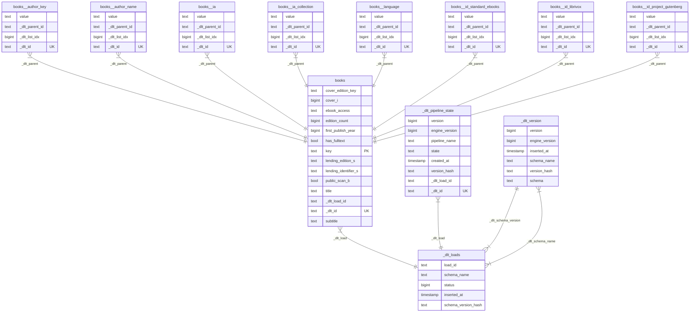

```mermaid

erDiagram
    _dlt_version{
    bigint version
    bigint engine_version
    timestamp inserted_at
    text schema_name
    text version_hash
    text schema
}
    _dlt_loads{
    text load_id
    text schema_name
    bigint status
    timestamp inserted_at
    text schema_version_hash
}
    books{
    text cover_edition_key
    bigint cover_i
    text ebook_access
    bigint edition_count
    bigint first_publish_year
    bool has_fulltext
    text key PK
    text lending_edition_s
    text lending_identifier_s
    bool public_scan_b
    text title
    text _dlt_load_id
    text _dlt_id UK
    text subtitle
}
    _dlt_pipeline_state{
    bigint version
    bigint engine_version
    text pipeline_name
    text state
    timestamp created_at
    text version_hash
    text _dlt_load_id
    text _dlt_id UK
}
    books__author_key{
    text value
    text _dlt_parent_id
    bigint _dlt_list_idx
    text _dlt_id UK
}
    books__author_name{
    text value
    text _dlt_parent_id
    bigint _dlt_list_idx
    text _dlt_id UK
}
    books__ia{
    text value
    text _dlt_parent_id
    bigint _dlt_list_idx
    text _dlt_id UK
}
    books__ia_collection{
    text value
    text _dlt_parent_id
    bigint _dlt_list_idx
    text _dlt_id UK
}
    books__language{
    text value
    text _dlt_parent_id
    bigint _dlt_list_idx
    text _dlt_id UK
}
    books__id_standard_ebooks{
    text value
    text _dlt_parent_id
    bigint _dlt_list_idx
    text _dlt_id UK
}
    books__id_librivox{
    text value
    text _dlt_parent_id
    bigint _dlt_list_idx
    text _dlt_id UK
}
    books__id_project_gutenberg{
    text value
    text _dlt_parent_id
    bigint _dlt_list_idx
    text _dlt_id UK
}
    books }|--|| _dlt_loads : "_dlt_load"
    _dlt_pipeline_state }|--|| _dlt_loads : "_dlt_load"
    books__author_key }|--|| books : "_dlt_parent"
    books__author_name }|--|| books : "_dlt_parent"
    books__ia }|--|| books : "_dlt_parent"
    books__ia_collection }|--|| books : "_dlt_parent"
    books__language }|--|| books : "_dlt_parent"
    books__id_standard_ebooks }|--|| books : "_dlt_parent"
    books__id_librivox }|--|| books : "_dlt_parent"
    books__id_project_gutenberg }|--|| books : "_dlt_parent"
    _dlt_version ||--|{ _dlt_loads : "_dlt_schema_version"
    _dlt_version }|--|{ _dlt_loads : "_dlt_schema_name"

```
